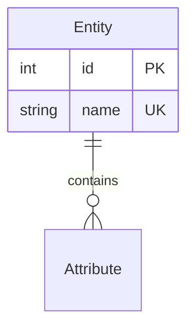

# Claude Code Context - DiagramDesigner

**Project**: DiagramDesigner
**Feature**: main
**Last Updated**: 2025-10-03

## Project Overview
DiagramDesigner is a three-tier web application for creating and managing data model diagrams with entity-relationship visualization. The application features a frontend for interactive diagram editing, a backend API for business logic and data management, and a database for persistent storage. It supports local development environments and deployment to Azure cloud infrastructure, enabling both individual use and collaborative scenarios.

## Tech Stack
- **Frontend**: TypeScript 5.x, React 18+
- **Backend**: Python 3.12+, Flask 3.x
- **Database**: PostgreSQL (local dev), Azure SQL Database (production)
- **ORM**: SQLAlchemy 2.x with Alembic migrations
- **Testing**: Vitest/Jest (frontend unit), pytest (backend unit), Playwright (E2E integration)
- **Deployment**: Azure Container Apps (backend), Azure Static Web Apps (frontend)

## Project Structure
```
backend/
├── src/
│   ├── models/           # SQLAlchemy models (Superdomain, Domain, Entity, Attribute, Diagram, etc.)
│   ├── services/         # Business logic layer
│   ├── api/              # Flask API routes and controllers
│   ├── repositories/     # Data access layer
│   └── utils/            # Helper functions and utilities
├── tests/
│   ├── contract/         # API contract tests (generated from OpenAPI)
│   ├── integration/      # Integration tests
│   └── unit/             # Unit tests for services and models
├── migrations/           # Alembic database migrations
└── requirements.txt      # Python dependencies

frontend/
├── src/
│   ├── components/       # React components (Canvas, EntityCard, RelationshipLine, etc.)
│   ├── pages/            # Page-level components (DiagramEditor, RepositoryBrowser, etc.)
│   ├── services/         # API client services
│   ├── hooks/            # Custom React hooks
│   ├── store/            # State management (React Context or Zustand)
│   └── types/            # TypeScript type definitions
├── tests/
│   ├── unit/             # Component unit tests
│   └── e2e/              # Playwright end-to-end tests
└── package.json          # Node.js dependencies

infrastructure/
├── local/                # Docker Compose for local development
│   └── docker-compose.yml
└── azure/                # Azure deployment configuration
    ├── bicep/            # Infrastructure-as-code templates
    └── pipelines/        # CI/CD pipeline definitions
```

## Key Architectural Patterns

### Repository Pattern
The backend uses a repository pattern for data access:
- `repositories/`: Isolates database operations from business logic
- Each entity type has its own repository (e.g., `entity_repository.py`, `diagram_repository.py`)
- Repositories provide CRUD operations and complex queries

### Service Layer Pattern
Business logic is centralized in services:
- `services/`: Handles validation, authorization, and business workflows
- Services use repositories for data access
- API layer delegates to services

### Dual Repository Architecture
The data model separates concerns:
- **Object Repository**: Canonical data model (Superdomain → Domain → Entity → Attribute → Relationship)
- **Diagram Repository**: Visual representations (Diagram → DiagramObject → DiagramRelationship)
- Changes to objects in repository automatically sync to all diagrams

## Core Entities

### Object Repository
- **Superdomain**: Top-level container (e.g., "Business")
- **Domain**: Business area within superdomain (e.g., "Sales")
- **Entity**: Business object with attributes (e.g., "Customer")
- **Attribute**: Entity property with data type, constraints (e.g., "email: String")
- **Relationship**: Connection between entities with cardinality (1:1, 1:N, N:N)

### Diagram Repository
- **Diagram**: Visual perspective on data model with canvas settings
- **DiagramObject**: Entity/Domain/Superdomain placed on canvas with position and style
- **DiagramRelationship**: Relationship line displayed on diagram with routing and crow's foot notation

### Scale Requirements
- 5 superdomains, 50 domains, 2000 entities, 100,000 attributes
- Up to 200 diagrams per project
- 20 concurrent users
- 60fps canvas rendering
- <200ms API response time
- <100ms user action feedback

## API Contract
API follows OpenAPI 3.0 specification located at `specs/main/contracts/openapi.yaml`

Key endpoints:
- `POST /api/v1/auth/login` - User authentication
- `GET /api/v1/superdomains` - List superdomains
- `POST /api/v1/entities` - Create entity
- `GET /api/v1/diagrams/:id` - Get diagram with full details
- `POST /api/v1/diagrams/:id/objects` - Add object to diagram
- `PUT /api/v1/diagrams/:id/objects/:objId` - Update object position/style

All requests require JWT authentication (except login/register)
Responses use standard HTTP status codes and JSON format

## Development Workflow

### Local Development
1. Start environment: `cd infrastructure/local && docker-compose up -d`
2. Services run on:
   - Frontend: http://localhost:3000
   - Backend: http://localhost:5000
   - Database: localhost:5432
3. Hot reload enabled for both frontend and backend

### Testing Strategy (TDD)
1. Write contract tests from OpenAPI spec (must fail initially)
2. Write integration tests for service layer (must fail)
3. Write unit tests for implementation (must fail)
4. Implement minimum code to pass tests
5. Refactor with tests as safety net
6. Write E2E tests for complete workflows

### Database Migrations
- Use Alembic for schema changes: `alembic revision -m "description"`
- Test migrations on both PostgreSQL and Azure SQL
- Migrations must be backward-compatible
- Run migrations: `alembic upgrade head`

## Constitutional Principles

This project adheres to constitutional principles (see `.specify/memory/constitution.md`):

1. **User-Centric Design**: Features validated against real user workflows
2. **Visual Clarity**: 60fps rendering, pixel-perfect accuracy
3. **Modular Architecture**: Clear separation of concerns, reusable components
4. **Test-Driven Development**: Tests before implementation (NON-NEGOTIABLE)
5. **Performance & Responsiveness**: <100ms feedback, handles 1000+ elements

## Recent Changes

### 2025-10-03: Initial Planning
- Created feature specification for main application
- Designed three-tier architecture (frontend/backend/database)
- Defined data model with dual repository pattern
- Generated OpenAPI contract with REST endpoints
- Created quickstart guide for local and Azure deployment
- Established technology stack: React + Flask + PostgreSQL/Azure SQL

## Performance Targets
- Canvas: 60fps rendering during drag/pan/zoom
- API: <200ms response time for simple queries
- UI: <100ms feedback for user actions
- Scale: 1000+ diagram elements without degradation
- Database: Efficient queries for 100,000 attributes

## Common Commands

### Backend
```bash
cd backend
python -m venv venv
source venv/bin/activate  # or venv\Scripts\activate on Windows
pip install -r requirements.txt
flask run
pytest tests/
```

### Frontend
```bash
cd frontend
npm install
npm run dev
npm test
npm run build
```

### Database
```bash
# Migrations
alembic revision -m "description"
alembic upgrade head
alembic downgrade -1

# Backup
docker-compose exec db pg_dump -U diagramdesigner > backup.sql
```

### Docker
```bash
cd infrastructure/local
docker-compose up -d
docker-compose ps
docker-compose logs -f
docker-compose down
```

## Azure Deployment
```bash
# Login
az login

# Deploy infrastructure
cd infrastructure/azure/bicep
az deployment group create --resource-group rg-diagramdesigner --template-file main.bicep

# Build and deploy backend
cd backend
az acr build --registry <name> --image diagramdesigner-backend:latest .
az containerapp update --name ca-diagramdesigner-backend --image <name>.azurecr.io/diagramdesigner-backend:latest

# Deploy frontend
cd frontend
npm run build
az staticwebapp deploy --name swa-diagramdesigner --app-location ./dist
```

## Key Design Decisions

1. **Integer PKs over UUIDs**: Auto-incrementing integers for simplicity, performance, and debuggability at current scale (20 users, single DB instance). Saves 75% key storage, better index locality, human-readable IDs. Trade-off: Not suitable for distributed writes or offline sync (acceptable for current requirements). See research.md for full analysis.
2. **React-Flow for Canvas**: Chosen for built-in zoom/pan, node-edge diagram support, and performance with 1000+ elements
3. **Zustand for State**: Lightweight state management avoiding React Context re-render issues
4. **Flask over FastAPI**: Simplicity preferred over async; this workload doesn't need async overhead
5. **PostgreSQL → Azure SQL**: PostgreSQL for local dev familiarity, Azure SQL for managed production benefits
6. **Crow's Foot Notation**: Industry standard for ER diagrams, clearly shows cardinality (1:1, 1:N, N:N)

## Documentation Standards

### Mermaid Diagrams
**STANDARD**: All diagrams in documentation MUST use Mermaid syntax for consistency and renderability.

**Common Diagram Types**:
- **Entity Relationship Diagrams**: Use `erDiagram` for data models
- **Flowcharts**: Use `flowchart TD` or `flowchart LR` for process flows
- **Sequence Diagrams**: Use `sequenceDiagram` for API interactions
- **Architecture Diagrams**: Use `graph TD` for system architecture

**Example ER Diagram**:


**Benefits**:
- Renders in GitHub, VS Code, and documentation tools
- Version controllable as text
- Easy to update and maintain
- Consistent styling across all docs

## Important Notes
- Always run tests before committing (TDD is constitutional requirement)
- API contracts must be updated when adding endpoints
- Database migrations must work on both PostgreSQL and Azure SQL
- Canvas performance is critical - profile before adding rendering features
- All timestamps in UTC
- **Integer primary keys** (auto-increment) for all entities; BIGINT for Attribute table (100K+ rows)
- Soft deletes with cascade impact analysis
- **All diagrams must use Mermaid syntax** (no ASCII art or images)

---
*This file is auto-generated and manually curated. Keep it under 175 lines for token efficiency.*
