# Data Model

**Feature**: DiagramDesigner Application
**Date**: 2025-10-03
**Status**: Complete

## Overview
This document defines the data model for the DiagramDesigner application, extracted from the feature specifications (main spec and feature branches 001-repo, 002-add-screens, 003-add-a-canvas). The model separates the object repository (canonical data model) from the diagram repository (visual representations).

## Entity Relationship Diagram

```mermaid
erDiagram
    User ||--o{ Superdomain : creates
    User ||--o{ Diagram : creates

    Superdomain ||--o{ Domain : contains
    Domain ||--o{ Entity : contains
    Entity ||--o{ Attribute : contains

    Entity ||--o{ Relationship : "source of"
    Entity ||--o{ Relationship : "target of"

    Diagram ||--o{ DiagramObject : contains
    Diagram ||--o{ DiagramRelationship : displays

    DiagramObject }o--|| Superdomain : references
    DiagramObject }o--|| Domain : references
    DiagramObject }o--|| Entity : references

    DiagramRelationship }o--|| Relationship : displays

    Superdomain {
        int id PK
        string name UK
        text description
        datetime created_at
        datetime updated_at
        int created_by FK
    }

    Domain {
        int id PK
        int superdomain_id FK
        string name
        text description
        datetime created_at
        datetime updated_at
        int created_by FK
    }

    Entity {
        int id PK
        int domain_id FK
        string name
        text description
        datetime created_at
        datetime updated_at
        int created_by FK
    }

    Attribute {
        bigint id PK
        int entity_id FK
        string name
        string data_type
        boolean is_nullable
        string default_value
        text description
        jsonb constraints
        jsonb data_quality_rules
        datetime created_at
        datetime updated_at
        int created_by FK
    }

    Relationship {
        int id PK
        int source_entity_id FK
        int target_entity_id FK
        bigint source_attribute_id FK
        bigint target_attribute_id FK
        string name
        string source_role
        string target_role
        enum source_cardinality
        enum target_cardinality
        text description
        datetime created_at
        datetime updated_at
        int created_by FK
    }

    Diagram {
        int id PK
        string name
        text description
        text purpose
        jsonb tags
        jsonb canvas_settings
        datetime created_at
        datetime updated_at
        int created_by FK
        int last_modified_by FK
    }

    DiagramObject {
        int id PK
        int diagram_id FK
        enum object_type
        int object_id
        float position_x
        float position_y
        float width
        float height
        int z_index
        jsonb visual_style
        boolean is_collapsed
        datetime created_at
        datetime updated_at
    }

    DiagramRelationship {
        int id PK
        int diagram_id FK
        int relationship_id FK
        boolean is_visible
        jsonb path_points
        string source_anchor
        string target_anchor
        jsonb visual_style
        datetime created_at
        datetime updated_at
    }

    User {
        int id PK
        string email UK
        string username UK
        string password_hash
        string full_name
        enum auth_provider
        string external_id
        boolean is_active
        datetime created_at
        datetime last_login_at
    }
```



## Core Entities

### Object Repository Entities

#### 1. Superdomain

**Purpose**: Top-level container in the data model hierarchy

**Fields**:
| Field | Type | Constraints | Description |
|-------|------|-------------|-------------|
| id | Integer | PK, NOT NULL, AUTO_INCREMENT | Unique identifier |
| name | String(100) | NOT NULL, UNIQUE | Superdomain name |
| description | Text | NULL | Markdown description |
| created_at | DateTime | NOT NULL | Creation timestamp |
| updated_at | DateTime | NOT NULL | Last update timestamp |
| created_by | Integer | FK → User, NULL | Creator user ID |

**Relationships**:
- `domains`: One-to-Many → Domain (cascade delete)

**Validation Rules**:
- Name must be non-empty and ≤100 characters
- Name must be unique across all superdomains
- Cannot be deleted if it has domains (or cascade delete with confirmation)

**Indexes**:
- PRIMARY KEY (id)
- UNIQUE INDEX (name)

---

#### 2. Domain

**Purpose**: Mid-level grouping within a superdomain, represents a logical business area

**Fields**:
| Field | Type | Constraints | Description |
|-------|------|-------------|-------------|
| id | Integer | PK, NOT NULL, AUTO_INCREMENT | Unique identifier |
| superdomain_id | Integer | FK → Superdomain, NOT NULL | Parent superdomain |
| name | String(100) | NOT NULL | Domain name |
| description | Text | NULL | Markdown description |
| created_at | DateTime | NOT NULL | Creation timestamp |
| updated_at | DateTime | NOT NULL | Last update timestamp |
| created_by | Integer | FK → User, NULL | Creator user ID |

**Relationships**:
- `superdomain`: Many-to-One → Superdomain
- `entities`: One-to-Many → Entity (cascade delete)

**Validation Rules**:
- Name must be non-empty and ≤100 characters
- Name must be unique within the same superdomain
- Must have a parent superdomain (default: "Other")
- Cannot be deleted if it has entities (or cascade delete with confirmation)

**Indexes**:
- PRIMARY KEY (id)
- FOREIGN KEY (superdomain_id)
- UNIQUE INDEX (superdomain_id, name)
- INDEX (superdomain_id) for queries

---

#### 3. Entity

**Purpose**: Represents a business object or concept (equivalent to a database table)

**Fields**:
| Field | Type | Constraints | Description |
|-------|------|-------------|-------------|
| id | Integer | PK, NOT NULL, AUTO_INCREMENT | Unique identifier |
| domain_id | Integer | FK → Domain, NOT NULL | Parent domain |
| name | String(100) | NOT NULL | Entity name |
| description | Text | NULL | Markdown description |
| created_at | DateTime | NOT NULL | Creation timestamp |
| updated_at | DateTime | NOT NULL | Last update timestamp |
| created_by | Integer | FK → User, NULL | Creator user ID |

**Relationships**:
- `domain`: Many-to-One → Domain
- `attributes`: One-to-Many → Attribute (cascade delete)
- `relationships_from`: One-to-Many → Relationship (as source_entity)
- `relationships_to`: One-to-Many → Relationship (as target_entity)

**Validation Rules**:
- Name must be non-empty and ≤100 characters
- Name must be unique within the same domain
- Must have a parent domain (default: "Other")
- Cannot be deleted if it has relationships or appears in diagrams (confirm cascade)

**Indexes**:
- PRIMARY KEY (id)
- FOREIGN KEY (domain_id)
- UNIQUE INDEX (domain_id, name)
- INDEX (domain_id) for queries

---

#### 4. Attribute

**Purpose**: Property or field of an entity (equivalent to a database column)

**Fields**:
| Field | Type | Constraints | Description |
|-------|------|-------------|-------------|
| id | BigInteger | PK, NOT NULL, AUTO_INCREMENT | Unique identifier (BigInt for 100K+ attributes) |
| entity_id | Integer | FK → Entity, NOT NULL | Parent entity |
| name | String(100) | NOT NULL | Attribute name |
| data_type | String(50) | NOT NULL | Data type (e.g., String, Integer, Boolean) |
| is_nullable | Boolean | NOT NULL, DEFAULT TRUE | Can be NULL |
| default_value | String(255) | NULL | Default value |
| description | Text | NULL | Markdown description |
| constraints | JSONB | NULL | Additional constraints (unique, min, max, etc.) |
| data_quality_rules | JSONB | NULL | Data quality validation rules |
| created_at | DateTime | NOT NULL | Creation timestamp |
| updated_at | DateTime | NOT NULL | Last update timestamp |
| created_by | Integer | FK → User, NULL | Creator user ID |

**Relationships**:
- `entity`: Many-to-One → Entity

**Validation Rules**:
- Name must be non-empty and ≤100 characters
- Name must be unique within the same entity
- data_type must be from allowed list
- Must have a parent entity
- Cannot be deleted if referenced by relationships (confirm cascade)

**Allowed Data Types**:
- String, Text, Integer, BigInteger, Float, Decimal, Boolean, Date, DateTime, Time, UUID, JSON

**Indexes**:
- PRIMARY KEY (id)
- FOREIGN KEY (entity_id)
- UNIQUE INDEX (entity_id, name)
- INDEX (entity_id) for queries

---

#### 5. Relationship

**Purpose**: Connection between two entities with cardinality configuration

**Fields**:
| Field | Type | Constraints | Description |
|-------|------|-------------|-------------|
| id | Integer | PK, NOT NULL, AUTO_INCREMENT | Unique identifier |
| source_entity_id | Integer | FK → Entity, NOT NULL | Source entity |
| target_entity_id | Integer | FK → Entity, NOT NULL | Target entity |
| source_attribute_id | BigInteger | FK → Attribute, NULL | Source attribute (if FK-based) |
| target_attribute_id | BigInteger | FK → Attribute, NULL | Target attribute (if FK-based) |
| name | String(100) | NULL | Relationship name/role |
| source_role | String(100) | NULL | Role of source in relationship |
| target_role | String(100) | NULL | Role of target in relationship |
| source_cardinality | Enum | NOT NULL | Source cardinality (ZERO_ONE, ONE, ZERO_MANY, ONE_MANY) |
| target_cardinality | Enum | NOT NULL | Target cardinality (ZERO_ONE, ONE, ZERO_MANY, ONE_MANY) |
| description | Text | NULL | Markdown description |
| created_at | DateTime | NOT NULL | Creation timestamp |
| updated_at | DateTime | NOT NULL | Last update timestamp |
| created_by | Integer | FK → User, NULL | Creator user ID |

**Relationships**:
- `source_entity`: Many-to-One → Entity
- `target_entity`: Many-to-One → Entity
- `source_attribute`: Many-to-One → Attribute (nullable)
- `target_attribute`: Many-to-One → Attribute (nullable)

**Validation Rules**:
- source_entity_id and target_entity_id must exist
- Can have self-referential relationships (source = target)
- Multiple relationships allowed between same entities (differentiated by role)
- source_role and target_role required if multiple relationships exist between same entities

**Cardinality Enum Values**:
- ZERO_ONE: 0..1 (optional, at most one)
- ONE: 1..1 (exactly one)
- ZERO_MANY: 0..N (optional, many)
- ONE_MANY: 1..N (at least one, many)

**Indexes**:
- PRIMARY KEY (id)
- FOREIGN KEY (source_entity_id)
- FOREIGN KEY (target_entity_id)
- INDEX (source_entity_id, target_entity_id) for queries

---

### Diagram Repository Entities

#### 6. Diagram

**Purpose**: A specific perspective/view on the data model with selected objects and visual layout

**Fields**:
| Field | Type | Constraints | Description |
|-------|------|-------------|-------------|
| id | Integer | PK, NOT NULL, AUTO_INCREMENT | Unique identifier |
| name | String(100) | NOT NULL | Diagram name |
| description | Text | NULL | Markdown description |
| purpose | Text | NULL | Markdown purpose statement |
| tags | JSONB | NULL | Array of tags for categorization |
| canvas_settings | JSONB | NULL | Canvas settings (zoom, pan, theme) |
| created_at | DateTime | NOT NULL | Creation timestamp |
| updated_at | DateTime | NOT NULL | Last update timestamp |
| created_by | Integer | FK → User, NULL | Creator user ID |
| last_modified_by | Integer | FK → User, NULL | Last modifier user ID |

**Relationships**:
- `diagram_objects`: One-to-Many → DiagramObject

**Validation Rules**:
- Name must be non-empty and ≤100 characters
- Name should be unique (soft validation, warn user)

**Canvas Settings Structure** (JSONB):
```json
{
  "zoom": 1.0,
  "pan": {"x": 0, "y": 0},
  "theme": "light",
  "gridSize": 20,
  "snapToGrid": true
}
```

**Indexes**:
- PRIMARY KEY (id)
- INDEX (created_by) for user's diagrams
- GIN INDEX (tags) for tag-based search

---

#### 7. DiagramObject

**Purpose**: Represents an object (Superdomain, Domain, or Entity) placed on a specific diagram with visual layout

**Fields**:
| Field | Type | Constraints | Description |
|-------|------|-------------|-------------|
| id | Integer | PK, NOT NULL, AUTO_INCREMENT | Unique identifier |
| diagram_id | Integer | FK → Diagram, NOT NULL | Parent diagram |
| object_type | Enum | NOT NULL | Type of object (SUPERDOMAIN, DOMAIN, ENTITY) |
| object_id | Integer | NOT NULL | ID of the referenced object |
| position_x | Float | NOT NULL | X coordinate on canvas |
| position_y | Float | NOT NULL | Y coordinate on canvas |
| width | Float | NULL | Custom width (null = auto) |
| height | Float | NULL | Custom height (null = auto) |
| z_index | Integer | NOT NULL, DEFAULT 0 | Layering order |
| visual_style | JSONB | NULL | Custom styling overrides |
| is_collapsed | Boolean | NOT NULL, DEFAULT FALSE | Collapsed state for hierarchical objects |
| created_at | DateTime | NOT NULL | Creation timestamp |
| updated_at | DateTime | NOT NULL | Last update timestamp |

**Relationships**:
- `diagram`: Many-to-One → Diagram
- References one of: Superdomain, Domain, or Entity (polymorphic)

**Validation Rules**:
- object_id must exist in the corresponding table based on object_type
- Position coordinates can be negative (infinite canvas)
- Cannot have duplicate (diagram_id, object_type, object_id) - same object appears once per diagram

**Object Type Enum Values**:
- SUPERDOMAIN
- DOMAIN
- ENTITY

**Visual Style Structure** (JSONB):
```json
{
  "backgroundColor": "#ffffff",
  "borderColor": "#000000",
  "borderWidth": 2,
  "fontSize": 14,
  "fontFamily": "Arial"
}
```

**Indexes**:
- PRIMARY KEY (id)
- FOREIGN KEY (diagram_id)
- UNIQUE INDEX (diagram_id, object_type, object_id)
- INDEX (object_type, object_id) for reverse lookup

---

#### 8. DiagramRelationship

**Purpose**: Represents a relationship line displayed on a specific diagram with visual routing

**Fields**:
| Field | Type | Constraints | Description |
|-------|------|-------------|-------------|
| id | Integer | PK, NOT NULL, AUTO_INCREMENT | Unique identifier |
| diagram_id | Integer | FK → Diagram, NOT NULL | Parent diagram |
| relationship_id | Integer | FK → Relationship, NOT NULL | Referenced relationship |
| is_visible | Boolean | NOT NULL, DEFAULT TRUE | Visibility toggle |
| path_points | JSONB | NULL | Custom routing points |
| source_anchor | String(20) | NULL | Source anchor point (top, bottom, left, right, auto) |
| target_anchor | String(20) | NULL | Target anchor point |
| visual_style | JSONB | NULL | Custom line styling |
| created_at | DateTime | NOT NULL | Creation timestamp |
| updated_at | DateTime | NOT NULL | Last update timestamp |

**Relationships**:
- `diagram`: Many-to-One → Diagram
- `relationship`: Many-to-One → Relationship

**Validation Rules**:
- relationship_id must exist in Relationship table
- Both source and target entities of the relationship must exist as DiagramObjects in the same diagram
- Cannot have duplicate (diagram_id, relationship_id) unless multiple visual paths are needed

**Visual Style Structure** (JSONB):
```json
{
  "lineColor": "#000000",
  "lineWidth": 2,
  "lineStyle": "solid",
  "arrowSize": 10,
  "labelVisible": true
}
```

**Indexes**:
- PRIMARY KEY (id)
- FOREIGN KEY (diagram_id)
- FOREIGN KEY (relationship_id)
- UNIQUE INDEX (diagram_id, relationship_id)
- INDEX (relationship_id) for cascade updates

---

### User & Authorization Entities

#### 9. User

**Purpose**: Represents a user of the application

**Fields**:
| Field | Type | Constraints | Description |
|-------|------|-------------|-------------|
| id | Integer | PK, NOT NULL, AUTO_INCREMENT | Unique identifier |
| email | String(255) | NOT NULL, UNIQUE | User email |
| username | String(100) | NOT NULL, UNIQUE | Username |
| password_hash | String(255) | NULL | Hashed password (null for Azure AD users) |
| full_name | String(200) | NULL | Full name |
| auth_provider | Enum | NOT NULL | Authentication provider (LOCAL, AZURE_AD) |
| external_id | String(255) | NULL | External auth provider ID |
| is_active | Boolean | NOT NULL, DEFAULT TRUE | Account active status |
| created_at | DateTime | NOT NULL | Creation timestamp |
| last_login_at | DateTime | NULL | Last login timestamp |

**Relationships**:
- `created_superdomains`: One-to-Many → Superdomain
- `created_diagrams`: One-to-Many → Diagram

**Validation Rules**:
- Email must be valid format and unique
- Username must be ≥3 characters and unique
- password_hash required if auth_provider is LOCAL

**Indexes**:
- PRIMARY KEY (id)
- UNIQUE INDEX (email)
- UNIQUE INDEX (username)
- INDEX (external_id, auth_provider) for external auth lookup

---

## State Transitions

### Entity Lifecycle
1. **Created**: Entity created with name and parent domain
2. **Active**: Normal state, can be edited and used in diagrams
3. **Referenced**: Appears in one or more diagrams or relationships
4. **Deletion Pending**: User requested deletion, system checks for references
5. **Deleted**: Soft deleted or hard deleted based on references and user confirmation

### Diagram Lifecycle
1. **Created**: Diagram created with name
2. **Editing**: Objects and relationships being added/modified
3. **Published**: Stable state, shared with other users
4. **Archived**: No longer active but preserved for history

## Data Integrity Rules

### Referential Integrity

1. **Hierarchy Enforcement**:
   - Superdomain must exist before Domain
   - Domain must exist before Entity
   - Entity must exist before Attribute
   - Default "Other" superdomain and domain always exist

2. **Diagram Consistency**:
   - DiagramObject must reference existing object (Superdomain/Domain/Entity)
   - DiagramRelationship must reference existing Relationship
   - DiagramRelationship requires both source and target entities to be present in diagram

3. **Cascade Rules**:
   - Delete Superdomain → Cascade to Domains (with confirmation)
   - Delete Domain → Cascade to Entities (with confirmation)
   - Delete Entity → Cascade to Attributes and Relationships (with confirmation)
   - Delete Object → Update or Remove from DiagramObjects (with notification)
   - Delete Diagram → Cascade to DiagramObjects and DiagramRelationships

### Validation Rules

1. **Naming Conventions**:
   - Names must be non-empty
   - Names must be ≤100 characters
   - Names should avoid special characters that could break queries
   - Names must be unique within their scope

2. **Relationship Rules**:
   - Relationship source and target entities must exist
   - Self-referential relationships allowed
   - Multiple relationships between same entities require unique roles

3. **Diagram Rules**:
   - Cannot add DiagramRelationship if either endpoint entity is not in diagram
   - Hidden relationships should be indicated in edit mode
   - Cannot exceed reasonable limits (e.g., 1000 objects per diagram for performance)

## Indexes & Performance

### Primary Indexes (Already Defined)
- All primary keys (UUIDs)
- All foreign keys
- Unique constraints on names within scope

### Additional Indexes for Common Queries

```sql
-- Query entities by domain
CREATE INDEX idx_entity_domain ON entity(domain_id);

-- Query domains by superdomain
CREATE INDEX idx_domain_superdomain ON domain(superdomain_id);

-- Query attributes by entity
CREATE INDEX idx_attribute_entity ON attribute(entity_id);

-- Query relationships by entity
CREATE INDEX idx_relationship_source ON relationship(source_entity_id);
CREATE INDEX idx_relationship_target ON relationship(target_entity_id);

-- Query diagram objects by diagram
CREATE INDEX idx_diagram_object_diagram ON diagram_object(diagram_id);

-- Reverse lookup: which diagrams contain an object
CREATE INDEX idx_diagram_object_lookup ON diagram_object(object_type, object_id);

-- Query diagrams by user
CREATE INDEX idx_diagram_creator ON diagram(created_by);

-- Tag-based diagram search
CREATE INDEX idx_diagram_tags ON diagram USING GIN(tags);

-- Timestamps for sorting
CREATE INDEX idx_diagram_updated ON diagram(updated_at DESC);
CREATE INDEX idx_entity_updated ON entity(updated_at DESC);
```

## Migration Strategy

### Initial Schema Creation
1. Create User table first (referenced by created_by)
2. Create Object Repository tables in hierarchy order (Superdomain → Domain → Entity → Attribute → Relationship)
3. Create Diagram Repository tables (Diagram → DiagramObject → DiagramRelationship)
4. Create indexes and constraints
5. Seed default "Other" superdomain and domain

### Schema Evolution
- All changes via Alembic migrations
- Migrations must be tested on both PostgreSQL (local) and Azure SQL (production)
- Backward-compatible changes preferred (add nullable columns, not drop columns immediately)
- Data migrations separate from schema migrations

## Summary

This data model supports:
- ✅ Dual repository architecture (FR-001 to FR-040 from spec 001-repo)
- ✅ CRUD operations for all entities (FR-001 to FR-020 from spec 002-add-screens)
- ✅ Canvas visualization with relationships (FR-001 to FR-033 from spec 003-add-a-canvas)
- ✅ Referential integrity and cascade deletes
- ✅ Multi-user support with ownership tracking
- ✅ Performance at scale (100,000 attributes, 2000 entities)
- ✅ Flexible querying and indexing
