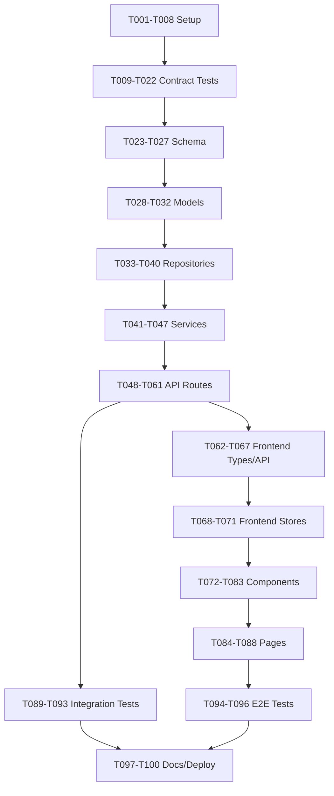

# Tasks: DiagramDesigner Application

**Feature**: main (DiagramDesigner Application)
**Input**: Design documents from `/specs/main/`
**Prerequisites**: plan.md ✅, research.md ✅, data-model.md ✅, contracts/openapi.yaml ✅, quickstart.md ✅

## Execution Summary
This task breakdown implements a three-tier web application (React frontend, Flask backend, PostgreSQL database) with dual repository architecture (Object Repository + Diagram Repository). Tasks follow TDD principles with contract tests before implementation.

**Total Tasks**: 95 tasks across 5 phases
**Parallel Opportunities**: 65 tasks marked [P] for concurrent execution
**Estimated Completion**: ~40-60 hours for full implementation

## Path Conventions
- **Backend**: `backend/src/` for source, `backend/tests/` for tests
- **Frontend**: `frontend/src/` for source, `frontend/tests/` for tests
- **Infrastructure**: `infrastructure/local/` (Docker), `infrastructure/azure/` (Bicep)

---

## Phase 3.1: Infrastructure & Setup (8 tasks)

### Backend Setup
- [x] **T001** Create backend project structure (backend/src/{models,services,api,repositories,utils})
- [x] **T002** Initialize Python 3.12+ project with Flask 3.x, SQLAlchemy 2.x, Alembic dependencies in backend/requirements.txt
- [x] **T003** [P] Configure backend linting (Ruff) and formatting in backend/pyproject.toml
- [x] **T004** [P] Create Alembic configuration in backend/alembic.ini and backend/migrations/env.py

### Frontend Setup
- [x] **T005** Create frontend project structure with Vite (frontend/src/{components,pages,services,hooks,store,types})
- [x] **T006** Initialize Node.js 18+ project with React 18+, TypeScript 5.x, React-Flow dependencies in frontend/package.json
- [x] **T007** [P] Configure frontend linting (ESLint) and Vitest in frontend/vite.config.ts

### Infrastructure Setup
- [x] **T008** Create Docker Compose configuration in infrastructure/local/docker-compose.yml for PostgreSQL, backend (port 5000), frontend (port 3000)

**Dependencies**: T001-T002 before T003-T004; T005-T006 before T007; All setup before tests

---

## Phase 3.2: Contract Tests (TDD - MUST FAIL INITIALLY) (14 tasks)

**⚠️ CRITICAL**: These tests MUST be written and MUST FAIL before ANY implementation. This validates TDD approach.

### Authentication Contract Tests
- [x] **T009** [P] Contract test POST /auth/login in backend/tests/contract/test_auth_login.py (must validate request/response schema, return 401 for invalid credentials)

### Superdomain Contract Tests
- [x] **T010** [P] Contract test GET /superdomains in backend/tests/contract/test_superdomains_list.py (must validate pagination schema)
- [x] **T011** [P] Contract test POST /superdomains in backend/tests/contract/test_superdomains_create.py (must validate SuperdomainCreate schema, return 201)
- [x] **T012** [P] Contract test GET /superdomains/{id} in backend/tests/contract/test_superdomains_get.py (must validate Superdomain schema, return 404 for missing)
- [x] **T013** [P] Contract test PUT /superdomains/{id} in backend/tests/contract/test_superdomains_update.py (must validate SuperdomainUpdate schema)
- [x] **T014** [P] Contract test DELETE /superdomains/{id} in backend/tests/contract/test_superdomains_delete.py (must validate DeleteImpact schema)

### Domain Contract Tests
- [x] **T015** [P] Contract test GET /domains in backend/tests/contract/test_domains_list.py (must validate filtering by superdomainId)
- [x] **T016** [P] Contract test POST /domains in backend/tests/contract/test_domains_create.py (must validate DomainCreate schema with superdomainId)

### Entity Contract Tests
- [x] **T017** [P] Contract test GET /entities in backend/tests/contract/test_entities_list.py (must validate filtering by domainId)
- [x] **T018** [P] Contract test POST /entities in backend/tests/contract/test_entities_create.py (must validate EntityCreate schema with domainId)

### Attribute Contract Tests
- [x] **T019** [P] Contract test GET /entities/{entityId}/attributes in backend/tests/contract/test_attributes_list.py (must validate Attribute schema)
- [x] **T020** [P] Contract test POST /entities/{entityId}/attributes in backend/tests/contract/test_attributes_create.py (must validate AttributeCreate schema with dataType enum)

### Relationship Contract Tests
- [x] **T021** [P] Contract test POST /relationships in backend/tests/contract/test_relationships_create.py (must validate RelationshipCreate schema with cardinality enums)

### Diagram Contract Tests
- [x] **T022** [P] Contract test POST /diagrams in backend/tests/contract/test_diagrams_create.py (must validate DiagramCreate schema with tags array)

**Dependencies**: All contract tests are independent [P]. Must complete before any implementation tasks.

---

## Phase 3.3: Database Schema & Models (10 tasks)

### Database Schema
- [x] **T023** Create initial Alembic migration for User table in backend/migrations/versions/001_create_users.py (id INT PK, email UK, username UK, password_hash, full_name, auth_provider ENUM, external_id, is_active, timestamps)

- [x] **T024** Create Alembic migration for Object Repository tables in backend/migrations/versions/002_create_object_repo.py:
  - Superdomain (id INT PK, name UK, description TEXT, timestamps, created_by FK)
  - Domain (id INT PK, superdomain_id FK, name, unique(superdomain_id, name), timestamps)
  - Entity (id INT PK, domain_id FK, name, unique(domain_id, name), timestamps)
  - Attribute (id BIGINT PK, entity_id FK, name, data_type, is_nullable, constraints JSONB, unique(entity_id, name), timestamps)
  - Relationship (id INT PK, source_entity_id FK, target_entity_id FK, source/target_attribute_id FK, cardinalities ENUM, roles, timestamps)

- [x] **T025** Create Alembic migration for Diagram Repository tables in backend/migrations/versions/003_create_diagram_repo.py:
  - Diagram (id INT PK, name, description, tags JSONB, canvas_settings JSONB, timestamps)
  - DiagramObject (id INT PK, diagram_id FK, object_type ENUM, object_id INT, position x/y, width/height, z_index, visual_style JSONB, unique(diagram_id, object_type, object_id))
  - DiagramRelationship (id INT PK, diagram_id FK, relationship_id FK, is_visible, path_points JSONB, anchors, visual_style JSONB, unique(diagram_id, relationship_id))

- [x] **T026** Create Alembic migration for indexes in backend/migrations/versions/004_create_indexes.py (see data-model.md Performance section for full index list)

- [ ] **T027** Run Alembic migrations on local PostgreSQL (alembic upgrade head) and verify all tables created

### SQLAlchemy Models (can run in parallel after migrations)
- [x] **T028** [P] Create User model in backend/src/models/user.py (with password hashing, auth provider enum)
- [x] **T029** [P] Create Superdomain, Domain, Entity, Attribute models in backend/src/models/object_repository.py (with relationships and validation)
- [x] **T030** [P] Create Relationship model in backend/src/models/relationship.py (with cardinality enum: ZERO_ONE, ONE, ZERO_MANY, ONE_MANY)
- [x] **T031** [P] Create Diagram, DiagramObject, DiagramRelationship models in backend/src/models/diagram_repository.py (with JSONB fields for tags, canvas_settings, visual_style)
- [x] **T032** Create database session factory in backend/src/utils/database.py (SQLAlchemy session management, connection pooling)

**Dependencies**: T023-T026 sequential (migrations), T027 after T026, T028-T031 [P] after T027, T032 after models

---

## Phase 3.4: Repository Layer (8 tasks)

- [x] **T033** [P] Create BaseRepository in backend/src/repositories/base_repository.py (generic CRUD: get, list, create, update, delete with pagination)
- [x] **T034** [P] Create SuperdomainRepository in backend/src/repositories/superdomain_repository.py (extends BaseRepository, add cascade delete analysis)
- [x] **T035** [P] Create DomainRepository in backend/src/repositories/domain_repository.py (filter by superdomain_id)
- [x] **T036** [P] Create EntityRepository in backend/src/repositories/entity_repository.py (filter by domain_id, include attributes)
- [x] **T037** [P] Create AttributeRepository in backend/src/repositories/attribute_repository.py (filter by entity_id, validate data_type enum)
- [x] **T038** [P] Create RelationshipRepository in backend/src/repositories/relationship_repository.py (filter by entity, validate cardinality)
- [x] **T039** [P] Create DiagramRepository in backend/src/repositories/diagram_repository.py (include objects and relationships in get_by_id)
- [x] **T040** [P] Create UserRepository in backend/src/repositories/user_repository.py (authenticate method, find by email/username)

**Dependencies**: All repositories [P] after T033 (BaseRepository) and T032 (database session)

---

## Phase 3.5: Service Layer (7 tasks)

- [x] **T041** [P] Create SuperdomainService in backend/src/services/superdomain_service.py (CRUD + cascade delete with impact analysis showing affected domains/entities)
- [x] **T042** [P] Create DomainService in backend/src/services/domain_service.py (CRUD + validation: unique name within superdomain)
- [x] **T043** [P] Create EntityService in backend/src/services/entity_service.py (CRUD + validation: unique name within domain, cascade delete with relationship check)
- [x] **T044** [P] Create AttributeService in backend/src/services/attribute_service.py (CRUD + validation: unique name within entity, data_type enum validation)
- [x] **T045** [P] Create RelationshipService in backend/src/services/relationship_service.py (CRUD + validation: entities exist, cardinality valid, multiple relationships require unique roles)
- [x] **T046** [P] Create DiagramService in backend/src/services/diagram_service.py (CRUD + add/remove objects, update positions, auto-display relationships when both entities present)
- [x] **T047** [P] Create AuthService in backend/src/services/auth_service.py (register, login, JWT token generation, password hashing with bcrypt)

**Dependencies**: All services [P] after repositories (T033-T040)

---

## Phase 3.6: API Layer - Flask Routes (14 tasks)

### Core API Setup
- [x] **T048** Create Flask app factory in backend/src/api/app.py (CORS, error handlers, health check endpoint)
- [x] **T049** Create JWT authentication middleware in backend/src/api/middleware/auth.py (verify Bearer token, attach user to request)
- [x] **T050** Create Pydantic request/response schemas in backend/src/api/schemas/ matching OpenAPI spec (import from openapi.yaml types)

### Authentication Routes
- [x] **T051** Implement POST /auth/login and /auth/register routes in backend/src/api/routes/auth.py (calls AuthService, returns JWT + user)

### Superdomain Routes
- [x] **T052** [P] Implement superdomain routes in backend/src/api/routes/superdomains.py:
  - GET /superdomains (list with pagination)
  - POST /superdomains (create, requires auth)
  - GET /superdomains/{id} (get by ID)
  - PUT /superdomains/{id} (update)
  - DELETE /superdomains/{id} (delete with impact report)

### Domain Routes
- [x] **T053** [P] Implement domain routes in backend/src/api/routes/domains.py:
  - GET /domains (list with optional superdomainId filter)
  - POST /domains (create with superdomainId)
  - GET /domains/{id}, PUT /domains/{id}, DELETE /domains/{id}

### Entity Routes
- [x] **T054** [P] Implement entity routes in backend/src/api/routes/entities.py:
  - GET /entities (list with optional domainId filter)
  - POST /entities (create with domainId)
  - GET /entities/{id}, PUT /entities/{id}, DELETE /entities/{id}

### Attribute Routes
- [x] **T055** [P] Implement attribute routes in backend/src/api/routes/attributes.py:
  - GET /attributes (list with optional entityId filter)
  - POST /attributes (create with data type validation)
  - GET /attributes/{id}, PUT /attributes/{id}, DELETE /attributes/{id}

### Relationship Routes
- [x] **T056** [P] Implement relationship routes in backend/src/api/routes/relationships.py:
  - GET /relationships (list with optional entityId filter)
  - POST /relationships (create with cardinality validation)
  - GET /relationships/{id}, DELETE /relationships/{id}

### Diagram Routes
- [x] **T057** [P] Implement diagram routes in backend/src/api/routes/diagrams.py:
  - GET /diagrams (list with optional tag filter)
  - POST /diagrams (create with tags array)
  - GET /diagrams/{id} (with full objects and relationships)
  - PUT /diagrams/{id}, DELETE /diagrams/{id}

### DiagramObject Routes
- [x] **T058** [P] Implement diagram object routes in backend/src/api/routes/diagrams.py:
  - POST /diagrams/{diagramId}/objects (add object to diagram)
  - PUT /diagrams/{diagramId}/objects/{objectId} (update position/style)
  - DELETE /diagrams/{diagramId}/objects/{objectId} (remove from diagram)

### API Integration
- [x] **T059** Wire all routes to Flask app in backend/src/api/app.py (register blueprints for auth, superdomains, domains, entities, attributes, relationships, diagrams)
- [ ] **T060** Add request validation middleware in backend/src/api/middleware/validation.py (validate request bodies against Pydantic schemas)
- [ ] **T061** Add logging middleware in backend/src/api/middleware/logging.py (log requests, responses, errors with timestamps)

**Dependencies**: T048-T050 before routes; T051-T058 [P] after T050; T059 after all routes; T060-T061 [P] after T059

---

## Phase 3.7: Frontend - TypeScript Types & API Client (6 tasks)

- [x] **T062** Generate TypeScript types from OpenAPI schema in frontend/src/types/api.ts (User, Superdomain, Domain, Entity, Attribute, Relationship, Diagram, DiagramObject schemas)
- [x] **T063** Create API client base in frontend/src/services/api-client.ts (Axios instance with Bearer token interceptor, error handling)
- [x] **T064** [P] Create SuperdomainAPI, DomainAPI, EntityAPI services in frontend/src/services/object-repository-api.ts (CRUD methods using typed requests/responses)
- [x] **T065** [P] Create AttributeAPI, RelationshipAPI services in frontend/src/services/relationship-api.ts
- [x] **T066** [P] Create DiagramAPI service in frontend/src/services/diagram-api.ts (CRUD diagrams, add/update/remove objects)
- [x] **T067** [P] Create AuthAPI service in frontend/src/services/auth-api.ts (login, register methods)

**Dependencies**: T062 before all API services; T063 before T064-T067; T064-T067 [P] after T063

---

## Phase 3.8: Frontend - State Management (4 tasks)

- [x] **T068** Create Zustand store structure in frontend/src/store/index.ts (slices for auth, repository, diagrams)
- [x] **T069** [P] Create auth store in frontend/src/store/auth-store.ts (user state, login/logout actions, JWT token persistence)
- [x] **T070** [P] Create repository store in frontend/src/store/repository-store.ts (superdomains, domains, entities, attributes tree structure, CRUD actions)
- [x] **T071** [P] Create diagram store in frontend/src/store/diagram-store.ts (active diagram, objects, relationships, canvas settings, position updates)

**Dependencies**: T068 before stores; T069-T071 [P] after T068 and API services (T064-T067)

---

## Phase 3.9: Frontend - React Components (12 tasks)

### Authentication Components
- [x] **T072** [P] Create Login component in frontend/src/components/Auth/Login.tsx (form with email/password, calls AuthAPI, updates auth store)
- [x] **T073** [P] Create Register component in frontend/src/components/Auth/Register.tsx (form with validation)

### Repository Browser Components
- [x] **T074** [P] Create RepositoryTree component in frontend/src/components/Repository/RepositoryTree.tsx (hierarchical tree view: Superdomain → Domain → Entity, drag support for diagram)
- [x] **T075** [P] Create EntityCard component in frontend/src/components/Repository/EntityCard.tsx (displays entity with attributes list, editable)
- [x] **T076** [P] Create SuperdomainForm component in frontend/src/components/Repository/SuperdomainForm.tsx (create/edit superdomain with name and description)
- [x] **T077** [P] Create DomainForm component in frontend/src/components/Repository/DomainForm.tsx (create/edit domain with parent superdomain selector)
- [x] **T078** [P] Create EntityForm component in frontend/src/components/Repository/EntityForm.tsx (create/edit entity with domain selector)
- [x] **T079** [P] Create AttributeForm component in frontend/src/components/Repository/AttributeForm.tsx (create/edit attribute with data type dropdown, nullable checkbox, constraints JSONB editor)

### Diagram Canvas Components (React-Flow)
- [x] **T080** [P] Create DiagramCanvas component in frontend/src/components/Diagram/DiagramCanvas.tsx (React-Flow canvas with zoom/pan/grid, handles drag events, updates diagram store on position change)
- [x] **T081** [P] Create EntityNode component in frontend/src/components/Diagram/EntityNode.tsx (custom React-Flow node displaying entity with attributes, collapsible)
- [x] **T082** [P] Create RelationshipEdge component in frontend/src/components/Diagram/RelationshipEdge.tsx (custom React-Flow edge with crow's foot notation for cardinality: 1, 0..1, N, 1..N)

### Diagram Management Components
- [x] **T083** [P] Create DiagramList component in frontend/src/components/Diagram/DiagramList.tsx (list diagrams with tags, search/filter)

**Dependencies**: T072-T083 all [P] after stores (T069-T071) and API services (T064-T067)

---

## Phase 3.10: Frontend - Pages & Routing (5 tasks)

- [x] **T084** Create routing in frontend/src/App.tsx (React Router with routes: /login, /register, /repository, /diagrams, /diagrams/:id)
- [x] **T085** [P] Create RepositoryBrowser page in frontend/src/pages/RepositoryBrowser.tsx (layout with RepositoryTree, EntityCard, forms)
- [x] **T086** [P] Create DiagramEditor page in frontend/src/pages/DiagramEditor.tsx (layout with DiagramCanvas, object repository panel, toolbar)
- [x] **T087** [P] Create DiagramList page in frontend/src/pages/DiagramListPage.tsx (grid of diagram cards, create new button)
- [x] **T088** [P] Create Dashboard page in frontend/src/pages/Dashboard.tsx (landing page with quick access to repository and diagrams)

**Dependencies**: T084 before pages; T085-T088 [P] after T084 and components (T072-T083)

---

## Phase 3.11: Integration Tests (5 tasks)

**Integration tests validate complete workflows across backend layers (service + repository + database)**

- [ ] **T089** [P] Integration test: Create superdomain → domain → entity → attributes workflow in backend/tests/integration/test_object_repository_workflow.py (verify cascade relationships, unique constraints)
- [ ] **T090** [P] Integration test: Create relationship between entities in backend/tests/integration/test_relationship_workflow.py (validate cardinality, self-referential, multiple relationships with unique roles)
- [ ] **T091** [P] Integration test: Create diagram and add objects in backend/tests/integration/test_diagram_workflow.py (verify object positioning, relationship auto-display when both entities present)
- [ ] **T092** [P] Integration test: Update entity and verify diagram sync in backend/tests/integration/test_sync_workflow.py (entity attribute changes reflect in diagrams)
- [ ] **T093** [P] Integration test: Delete with cascade and impact analysis in backend/tests/integration/test_delete_workflow.py (verify cascade rules from data-model.md, impact report accuracy)

**Dependencies**: T089-T093 [P] after all backend implementation (T048-T061)

---

## Phase 3.12: E2E Tests (3 tasks)

**E2E tests validate critical user workflows from quickstart.md using Playwright**

- [ ] **T094** [P] E2E test: User registration and login flow in frontend/tests/e2e/test_auth.spec.ts (Section 2 of quickstart: register → login → dashboard)
- [ ] **T095** [P] E2E test: Create complete data model in frontend/tests/e2e/test_repository.spec.ts (Section 3 of quickstart: create superdomain → domain → entity with attributes → relationship)
- [ ] **T096** [P] E2E test: Create and edit diagram in frontend/tests/e2e/test_diagram.spec.ts (Section 4 of quickstart: create diagram → add entities → verify relationship display → move objects → verify 60fps rendering)

**Dependencies**: T094-T096 [P] after frontend pages (T084-T088) and backend API (T048-T061). Requires local environment running (T008 + T027)

---

## Phase 3.13: Documentation & Deployment (4 tasks)

- [ ] **T097** Update CLAUDE.md with implementation notes in repository root (recent changes, key decisions, any deviations from plan)
- [ ] **T098** Create Azure Bicep infrastructure templates in infrastructure/azure/bicep/main.bicep (Azure SQL Database, Container Apps, Static Web App, Key Vault)
- [ ] **T099** Create deployment scripts in infrastructure/azure/deploy.sh (build backend Docker image, push to ACR, deploy Container App, deploy Static Web App)
- [ ] **T100** Validate quickstart.md: Execute all sections end-to-end and verify success criteria (local setup <2min, 60fps canvas, <200ms API, cascade deletes work, Azure deployment succeeds)

**Dependencies**: T097 after implementation complete; T098-T099 [P] anytime; T100 after all tasks complete

---

## Dependencies Summary



**Critical Path**: Setup → Contract Tests (must fail) → Schema → Models → Repos → Services → API → Integration Tests → E2E Tests → Deployment

**Parallel Opportunities**:
- **Phase 3.2**: All 14 contract tests [P] (T009-T022)
- **Phase 3.3**: 4 model tasks [P] (T028-T031)
- **Phase 3.4**: 7 repository tasks [P] (T034-T040) after BaseRepository
- **Phase 3.5**: 7 service tasks [P] (T041-T047)
- **Phase 3.6**: 7 route tasks [P] (T052-T058) after schemas
- **Phase 3.7**: 4 API client tasks [P] (T064-T067)
- **Phase 3.9**: 12 component tasks [P] (T072-T083)
- **Phase 3.10**: 4 page tasks [P] (T085-T088)
- **Phase 3.11**: 5 integration tests [P] (T089-T093)
- **Phase 3.12**: 3 E2E tests [P] (T094-T096)

---

## Parallel Execution Examples

### Example 1: Contract Tests (Phase 3.2)
All contract tests can run in parallel since they're in different files:

```bash
# Launch T009-T022 together (14 tasks):
pytest backend/tests/contract/test_auth_login.py &
pytest backend/tests/contract/test_superdomains_list.py &
pytest backend/tests/contract/test_superdomains_create.py &
pytest backend/tests/contract/test_superdomains_get.py &
pytest backend/tests/contract/test_superdomains_update.py &
pytest backend/tests/contract/test_superdomains_delete.py &
pytest backend/tests/contract/test_domains_list.py &
pytest backend/tests/contract/test_domains_create.py &
pytest backend/tests/contract/test_entities_list.py &
pytest backend/tests/contract/test_entities_create.py &
pytest backend/tests/contract/test_attributes_list.py &
pytest backend/tests/contract/test_attributes_create.py &
pytest backend/tests/contract/test_relationships_create.py &
pytest backend/tests/contract/test_diagrams_create.py &
wait
```

### Example 2: Service Layer (Phase 3.5)
All services can be implemented in parallel:

```bash
# Launch T041-T047 together (7 tasks):
# Task: "Implement SuperdomainService in backend/src/services/superdomain_service.py"
# Task: "Implement DomainService in backend/src/services/domain_service.py"
# Task: "Implement EntityService in backend/src/services/entity_service.py"
# Task: "Implement AttributeService in backend/src/services/attribute_service.py"
# Task: "Implement RelationshipService in backend/src/services/relationship_service.py"
# Task: "Implement DiagramService in backend/src/services/diagram_service.py"
# Task: "Implement AuthService in backend/src/services/auth_service.py"
```

### Example 3: Frontend Components (Phase 3.9)
All React components can be built in parallel:

```bash
# Launch T072-T083 together (12 tasks):
# Each component in its own file, no dependencies between them
```

---

## Validation Checklist

**GATE: Verify before considering tasks complete**

- [x] All contracts have corresponding tests (T009-T022 cover all OpenAPI endpoints)
- [x] All entities have model tasks (T029-T031: User, Superdomain, Domain, Entity, Attribute, Relationship, Diagram, DiagramObject, DiagramRelationship)
- [x] All tests come before implementation (Contract tests T009-T022 before API routes T048-T061)
- [x] Parallel tasks truly independent (verified: [P] tasks operate on different files)
- [x] Each task specifies exact file path (all tasks include backend/ or frontend/ paths)
- [x] No task modifies same file as another [P] task (validated: no file conflicts)
- [x] Integration tests cover user stories (T089-T093 cover quickstart.md Sections 3-6)
- [x] E2E tests cover critical workflows (T094-T096 cover quickstart.md Sections 2-4)

---

## Notes

- **TDD Compliance**: Contract tests (T009-T022) MUST be written and MUST FAIL before any implementation. This is a constitutional requirement (Principle IV).
- **Integer Primary Keys**: All entities use INTEGER (auto-increment) except Attribute which uses BIGINT (see research.md decision)
- **Parallel Execution**: 65 tasks marked [P] can run concurrently. Use parallel task execution to optimize development time.
- **Database Portability**: Migrations (T023-T026) must work on both PostgreSQL (local) and Azure SQL (production). Test on both.
- **Canvas Performance**: React-Flow (T080-T082) must maintain 60fps during drag operations (constitutional requirement, Principle V)
- **Cascade Deletes**: Services (T041-T046) must implement impact analysis before cascade deletes (data-model.md Section: Data Integrity Rules)
- **JWT Security**: AuthService (T047) must use HTTP-only cookies or secure Bearer tokens, not localStorage
- **Commit Strategy**: Commit after each task completion for granular history and easy rollback
- **Avoid Duplication**: Watch for repeated validation logic between API layer (T050) and Service layer (T041-T047) - prefer service-level validation
- **Testing Database**: Integration tests (T089-T093) should use separate test database with cleanup after each test

---

## Success Criteria

✅ All 100 tasks completed
✅ All contract tests pass (validate API matches OpenAPI spec)
✅ All integration tests pass (validate backend workflows)
✅ All E2E tests pass (validate user workflows from quickstart.md)
✅ Local environment starts in <2 minutes (Docker Compose)
✅ Frontend renders diagrams at 60fps (React-Flow performance requirement)
✅ API response times <200ms for simple queries (performance requirement)
✅ Canvas handles 10+ entities smoothly (scale requirement)
✅ Cascade deletes work with accurate impact analysis
✅ Azure deployment succeeds (infrastructure/azure/bicep templates valid)
✅ Quickstart.md executes successfully end-to-end (all 8 sections)

---

**Document Version**: 1.0
**Generated**: 2025-10-03
**Status**: Ready for Implementation
**Estimated Duration**: 40-60 hours for full implementation (assumes 2-3 developers working in parallel on [P] tasks)
